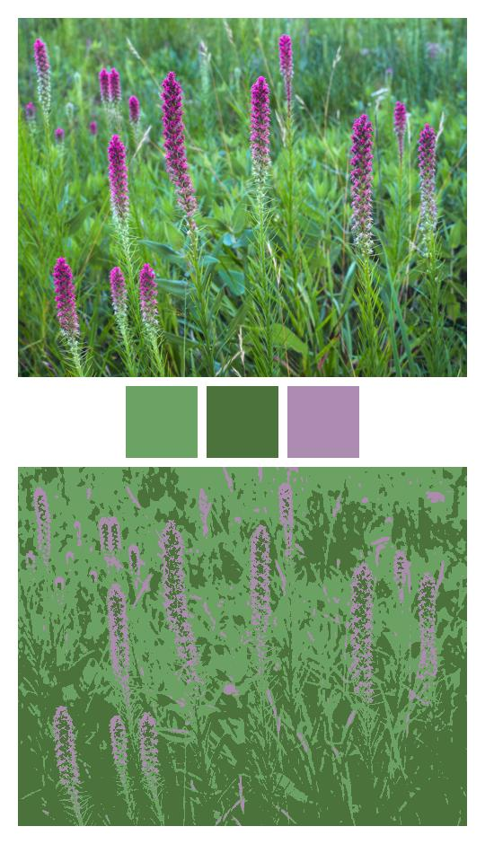

# ColorTools Tutorial

## What is ColorTools?

ColorTools is a commandline interface (CLI) application for analyzing and sorting images by their dominant colors. 

At its core is an image analysis module, which performs color analysis on the provided images using one of a couple different algorithms. Once the images are analyzed, the results can be used for sorting images along a number of different dimensions, as well as generating numerous types of summary graphics. 

## Illustrated Examples

### Example 1 
The simplest way to use ColorTools is to simply point it to a directory of images and generate a summary of the results. 

For each image, a list of dominant colors is provided in both RGB and HSV. Dominant colors are represented as lists of length 3 (for [R, G, B] or [H, S, V]). 

```
$ colortools input/tutorial --summary
```

Output:
```
Analyzed image summary:
1. 1.jpg: n=2, algorithm=kmeans 
    rgb=[[0, 70, 185], [3, 45, 133]]
    hsv=[[217, 100, 73], [221, 98, 52]]
2. 2.jpg: n=2, algorithm=kmeans 
    rgb=[[203, 155, 72], [130, 95, 42]]
    hsv=[[38, 64, 79], [36, 68, 51]]
3. 3.jpg: n=2, algorithm=kmeans 
    rgb=[[229, 229, 229], [181, 181, 181]]
    hsv=[[0, 0, 90], [0, 0, 71]]
4. 4.jpg: n=4, algorithm=kmeans 
    rgb=[[56, 35, 42], [111, 71, 89], [156, 120, 145], [238, 176, 157]]
    hsv=[[340, 37, 22], [333, 36, 44], [318, 23, 61], [14, 34, 93]]
5. 5.jpg: n=2, algorithm=kmeans 
    rgb=[[68, 92, 5], [146, 165, 39]]
    hsv=[[76, 95, 36], [69, 76, 65]]
6. 6.jpg: n=3, algorithm=kmeans 
    rgb=[[236, 194, 198], [190, 128, 145], [49, 59, 95]]
    hsv=[[354, 18, 92], [344, 32, 74], [227, 48, 37]]
7. 7.jpg: n=2, algorithm=kmeans 
    rgb=[[81, 81, 81], [152, 152, 152]]
    hsv=[[0, 0, 32], [0, 0, 59]]
8. 8.jpg: n=2, algorithm=kmeans 
    rgb=[[47, 47, 47], [221, 221, 221]]
    hsv=[[0, 0, 18], [0, 0, 87]]
9. 9.jpg: n=2, algorithm=kmeans 
    rgb=[[48, 60, 89], [208, 174, 75]]
    hsv=[[222, 46, 35], [44, 64, 82]]
10. 10.jpg: n=2, algorithm=kmeans 
    rgb=[[151, 176, 203], [77, 103, 133]]
    hsv=[[211, 26, 80], [213, 42, 52]]
11. 11.jpg: n=3, algorithm=kmeans 
    rgb=[[107, 163, 100], [76, 115, 59], [172, 140, 176]]
    hsv=[[113, 38, 64], [101, 48, 45], [294, 20, 69]]
12. 12.jpg: n=4, algorithm=kmeans 
    rgb=[[105, 100, 97], [74, 72, 76], [215, 180, 83], [224, 173, 12]]
    hsv=[[20, 8, 41], [263, 6, 30], [44, 62, 84], [46, 95, 88]]
```


### Example 2
We could also sort the images by the hue of their dominant color.

```
$ colortools input/tutorial --sort hue
```

Output:
```
Sorted 12 images:
   1. input/tutorial/4.jpg
   2. input/tutorial/6.jpg
   3. input/tutorial/12.jpg
   4. input/tutorial/2.jpg
   5. input/tutorial/5.jpg
   6. input/tutorial/11.jpg
   7. input/tutorial/10.jpg
   8. input/tutorial/1.jpg
   9. input/tutorial/9.jpg
  10. input/tutorial/8.jpg
  11. input/tutorial/7.jpg
  12. input/tutorial/3.jpg
```


### Example 3
Or we could generate graphics depicting the dominant colors that were computed. (By default, all output graphics are saved to a folder in the current directory named `output`. If we wanted to change where these output graphics were saved, we could use the `--output-dir` argument.)

```
$ colortools input/tutorial --dominant_colors
```

Sample of resulting graphics: 

Image 1 | Image 2 | image 3
:------:|:-------:|:-------:
|||


### Example 4
We can do the same thing with a different dominant color algorithm. Here's we'll use the `hue_dist` algorithm. 

```
$ colortools input/tutorial --dominant_colors --algorithm hue_dist
```

Sample of resulting graphics: 

Image 1 | Image 2 | image 3
:------:|:-------:|:-------:
|||


### Example 5
Notice something about the results in the previous example? Many of the computed dominant colors are quite similar. (You probably saw warnings about this in the console after you ran this command.) This dominant color detection algorithm only works well for determining the _single_ most dominant color. 

To do that, we can use the `--n_colors` argument. 

```
$ colortools input/tutorial --dominant_colors --algorithm hue_dist --n_colors 1
```

Sample of resulting graphics: 

Image 1 | Image 2 | image 3
:------:|:-------:|:-------:
|||


### Example 6
Without the `--n_colors` argument, the number of colors to find is determined dynamically. It is possible to use a different heuristic for setting the number of colors, but in general, these heuristics are mostly experimental. You can try them out using the `--n_colors-heuristic` argument. 

```
$ colortools input/tutorial --dominant_colors --n_colors_heuristic auto_n_hue
```

Sample of resulting graphics: 

Image 1 | Image 2 | image 3
:------:|:-------:|:-------:
|||


### Example 7
If using the default `kmeans` algorithm for computing dominant colors, you are able to map each pixel of the original image to the closest dominant color using the `--dominant_colors_remapped` argument. (This argument is ignored if using the `hue_dist` algorithm.)

```
$ colortools input/tutorial --dominant_colors --dominant_colors_remapped
```

Image 1 | Image 2 | image 3
:------:|:-------:|:-------:
|||


### Example 8
In addition to generating graphics for the dominant colors, we can also generate what I call a "spectrum" for the input images. Each bar in the spectrum represents the dominant color of one of the input images. 

```
$ colortools input/tutorial --spectrum
```

Output graphic: 


### Example 9
Notice that each bar consists of only one color, even though multiple dominant colors were likely computed for each image. If we would like to include all of these colors in the spectrum graphic, we can use the `--spectrum-all-colors` argument. When this argument is used, each bar represents a distribution of dominant colors for the underlying input image. 

```
$ colortools input/tutorial --spectrum --spectrum_all_colors
```

Output graphic: 


### Example 10
You can also generate collages of the input images. 

```
$ colortools input/tutorial --collage
```

Output graphic: 


### Example 11
Collages on their own aren't too interesting, however. We can make them more interesting by sorting the images by their _hue_ before creating the collage. Let's also generate a sorted spectrum graphic while we're at it. 

Note when sorting by hue, black and white images always appear at the end of the sequence.

```
$ colortools input/tutorial --spectrum --collage --sort hue
```

Output graphics: 


### Example 12
We can reverse the sort order. 

```
$ colortools input/tutorial --spectrum --collage --sort hue --sort_reverse
```

Output graphics: 


### Example 13
We can also use a different method of sorting. Here, we'll sort the images by the _saturation_ of their dominant color. Results are returned in ascending order, with ties broken by the value of the dominant color, then by color. 

```
$ colortools input/tutorial --spectrum --collage --sort saturation
```

Output graphics: 


### Example 14
Or we can sort by the _value_ of the dominant color, which approximates brightness. Again, results are returned in ascending order. This time, ties are broken by the hue of the dominant color, then by saturation.

```
$ colortools input/tutorial --spectrum --collage --sort value
```

Output graphics: 


### Example 15
We can set an image as a sort anchor when we are sorting. When we do this, sort order is maintained, but the anchor image is used as the first image in the sequence.

In this example, we'll use this image (stored on my machine as `input/11.jpg`) as the anchor image: 


```
$ colortools input/tutorial --spectrum --collage --sort hue --sort_anchor 11.jpg
```

Output graphics: 


Again, note that when sorting by hue, even when using a sort anchor, black and white images will appear at the end of the sorted sequence. 


### Example 16
However, if we wanted to, we could exclude black and white images from all output graphics. 

```
$ colortools input/tutorial --spectrum --collage --sort hue --sort_anchor 11.jpg --exclude_bw
```

Output graphics: 


### Example 17
It is also possible to generate all output graphic types with a single command. 

Some notes on the input arguments: 
- When `--dominant_colors-remapped` is provided, there is no need to also include `--dominant_colors`. 
- When `--sort_saved` is provided, there is no need to provide a value for `--sort`; the default sorting method is by _hue_. 

```
$ colortools input/tutorial --summary --dominant_colors_remapped --spectrum --collage --save_sorted
```

Summary printout: 
```
Analyzed image summary:
1. 4.jpg: n=4, algorithm=kmeans 
    rgb=[[56, 35, 42], [111, 71, 89], [156, 120, 145], [238, 176, 157]]
    hsv=[[340, 37, 22], [333, 36, 44], [318, 23, 61], [14, 34, 93]]
2. 6.jpg: n=3, algorithm=kmeans 
    rgb=[[236, 194, 198], [190, 128, 145], [49, 59, 95]]
    hsv=[[354, 18, 92], [344, 32, 74], [227, 48, 37]]
3. 12.jpg: n=4, algorithm=kmeans 
    rgb=[[105, 100, 97], [74, 72, 76], [215, 180, 83], [224, 173, 12]]
    hsv=[[20, 8, 41], [263, 6, 30], [44, 62, 84], [46, 95, 88]]
4. 2.jpg: n=2, algorithm=kmeans 
    rgb=[[203, 155, 72], [130, 95, 42]]
    hsv=[[38, 64, 79], [36, 68, 51]]
5. 5.jpg: n=2, algorithm=kmeans 
    rgb=[[68, 92, 5], [146, 165, 39]]
    hsv=[[76, 95, 36], [69, 76, 65]]
6. 11.jpg: n=3, algorithm=kmeans 
    rgb=[[107, 163, 100], [76, 115, 59], [172, 140, 176]]
    hsv=[[113, 38, 64], [101, 48, 45], [294, 20, 69]]
7. 10.jpg: n=2, algorithm=kmeans 
    rgb=[[151, 176, 203], [77, 103, 133]]
    hsv=[[211, 26, 80], [213, 42, 52]]
8. 1.jpg: n=2, algorithm=kmeans 
    rgb=[[0, 70, 185], [3, 45, 133]]
    hsv=[[217, 100, 73], [221, 98, 52]]
9. 9.jpg: n=2, algorithm=kmeans 
    rgb=[[48, 60, 89], [208, 174, 75]]
    hsv=[[222, 46, 35], [44, 64, 82]]
10. 8.jpg: n=2, algorithm=kmeans 
    rgb=[[47, 47, 47], [221, 221, 221]]
    hsv=[[0, 0, 18], [0, 0, 87]]
11. 7.jpg: n=2, algorithm=kmeans 
    rgb=[[81, 81, 81], [152, 152, 152]]
    hsv=[[0, 0, 32], [0, 0, 59]]
12. 3.jpg: n=2, algorithm=kmeans 
    rgb=[[229, 229, 229], [181, 181, 181]]
    hsv=[[0, 0, 90], [0, 0, 71]]
```

Selected dominant color graphics with remapping: 

Image 1 | Image 2 | image 3
:------:|:-------:|:-------:
|||

Spectrum graphic: 


Collage graphic: 


Finally, sorted images are saved to a folder named by the current timestamp in `output/sorted/`.
